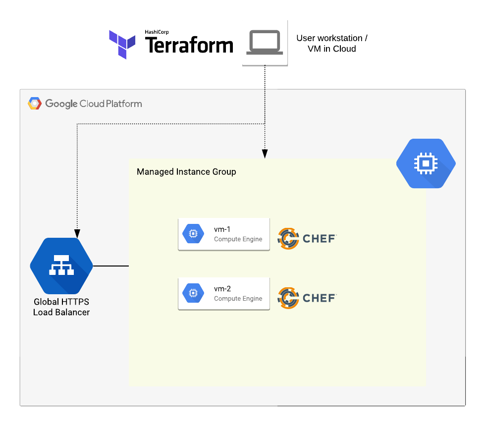
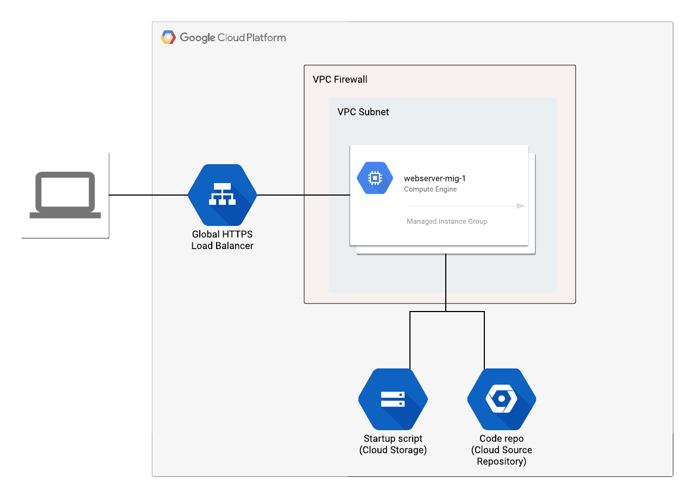

# Simple website deployment with Terraform and Chef on GCP



This example demonstrates secure deployment of a simple website on GCP using Terraform to create the infrastructure (Project, VPC, Load Balanced MIG cluster etc.) and Chef to configure the VMs.
* Terraform is a popular tool for creation and management of Infrastructure as Code.
* Chef is a popular tool for configuration management of systems and applications.
* [Private Google Access on VPC Subnets](https://cloud.google.com/vpc/docs/configure-private-google-access) is enabled so that the VM instances with private IPs can reach Google APIs and Services.
* Firewall rules are used to control inbound traffic through the Load Balancer only and no traffic goes to the VMs directly.

### GCP Resources Created
The below resources are created using Terraform modules:
1. Project
2. VPC Network (subnets, routes, firewall rules)
3. Service Account
4. Managed Instance Group (MIG)
5. Global HTTPS LB
6. GCS Bucket

### Requirements:
A basic understanding of the below tools will be essential to understand this example:
1. [Terraform](https://www.terraform.io/) (must be installed already)
2. [Terraform GCP Provider](https://www.terraform.io/docs/providers/google/index.html)
3. [Chef](https://www.chef.io/)
4. [Git](https://git-scm.com/) (must be installed already)
5. [Cloud SDK](https://cloud.google.com/sdk/) (must be installed already)

### Deployment Architecture


## Pre-deployment Prep

### 1. Clone code repo from github
   ```
    $ git clone https://github.com/r4hulgupta/simple-website-tf-chef.git

    $ cd simple-website-tf-chef/
   ```

### 2. Initialize gcloud
If not done so already, initialize your gcloud to set appropriate project and authentication to GCP.
```
$ gcloud init
    
    <... Follow the interactive prompts to set values for project, zone defaults etc. ...>

$ gcloud auth login
```

### 3. Setup a seed project
We will use a shell script to do initial seed project setup.
> Feel free to skip running this script if you already have a project with that you can use as seed project and if that project already has the below configuration.

The script will perform below actions:
1. Create a new seed project
2. Assign billing account to seed project
3. Create GCS bucket for Terraform state
4. Create a GSR repo for source code management
5. Create a GCP IAM service account to use with Terraform to perform deployment
6. Create a service account key and save it locally
7. Grant permissions to deployment service account
    1. On the organization level
        * roles/resourcemanager.organizationViewer
        * roles/resourcemanager.projectCreator
        * roles/billing.user
        * roles/compute.networkAdmin
        * roles/iam.serviceAccountAdmin
    2. On the seed project level
        * roles/compute.instanceAdmin.v1
        * roles/storage.admin
        * roles/resourcemanager.projectIamAdmin
8. Enable required APIs
    * cloudresourcemanager.googleapis.com
    * cloudbilling.googleapis.com
    * iam.googleapis.com
    * admin.googleapis.com
    * sourcerepo.googleapis.com
    * storage-api.googleapis.com

#### Set variables for setup_seed_prj.sh
Edit [/helpers/setup_seed_prj.env](./helpers/setup_seed_prj.env) file to set some variables that will be used by the script to setup your seed project.

```
ORG_ID="<YOUR_ORG_ID>"
BILLING_ACCOUNT="<YOUR_BILLING_ACCOUNT_ID>"
TF_BUCKET_NAME="<DESIRED_BUCKET_NAME>"
SEED_PROJECT="<DESIRED_PROJECT_NAME>"
SA_NAME="<DESIRED_SERVICE_ACCOUNT_NAME>"
KEY_FILE="<DESIRED_KEY_FILE_LOCAL_PATH>"
CODE_REPO_NAME="mychefrepo"  # Do not change
```

#### Run script setup_seed_prj.sh
```
$ /helpers/setup_seed_prj.sh
```

## Deployment Steps
### 1. Some variables to be used throughout the deployment
We will use the below values for this example, it will be easy to use some commands later if you set these variables on your shell.
> if you change any of the below values, make sure to use the same value throughout the example.
```
CORE_PROJECT="my-core-prj"
GOLD_IMAGE_VM="ws-dev-gold"

VPC_NAME="my-core-vpc"
GCP_REGION_A="us-west1"
GCP_REGION_B="us-central1"
GCP_ZONE="us-west1-b"

APP_SA_NAME="svc-ws-dev"

HELPER_BUCKET="my-core-prj-deployment-helpers"

DEPLOYMENT_ID = "my-dev-website" 
```

### 2. Create a Project and custom VPC Network
We will use Terraform [Project Factory module](https://registry.terraform.io/modules/terraform-google-modules/project-factory/google) to create a project and [Network module](https://registry.terraform.io/modules/terraform-google-modules/network/google) to create a custom network.
> Project Factory module has a `auto_create_network` option which will be set to `false` so that the default network is not created.

The below components will be created by Terraform:
1. Project Name: $CORE_PROJECT
2. VPC Name: $VPC_NAME
3. Subnets:
    1. dev-$VPC_NAME-$GCP_REGION_A
    2. prd-$VPC_NAME-$GCP_REGION_A
    3. sse-$VPC_NAME-$GCP_REGION_A
    4. tst-$VPC_NAME-$GCP_REGION_A
    5. dev-$VPC_NAME-$GCP_REGION_B
    6. prd-$VPC_NAME-$GCP_REGION_B
    7. sse-$VPC_NAME-$GCP_REGION_B
    8. tst-$VPC_NAME-$GCP_REGION_B
4. Private google access enabled on all the subnets
5. Firewall rules
    * Allow HTTP health check traffic between LB and instances with network tag **allow-health-check**
    * Allow API traffic to GCP private endpoints (199.36.153.4/30)
6. Routes
    * Route to ‘199.36.153.4/30’ with internet gateway as the next hop
7. GCS Bucket to be used for deployment automation helper scripts and installers
    * Helper bucket name: $HELPER_BUCKET

#### Steps
1. Set Terraform backend config.
    1. Edit file [/single-project-vpc/core/backend.tf](./single-project-vpc/core/backend.tf).
    2. Replace `<TF_BUCKET_NAME>` with the value of `$TF_BUCKET_NAME`.
    3. Save the file.

2. Make a copy of terraform.tfvars template.
    ```
    $ cd simple-website-tf-chef/single-project-vpc/core
    $ cp terraform.tfvars.template terraform.tfvars
    ```
3. Set the values in terraform.tfvars as needed and save the file.
    ```
    organization_id = "<ORG_ID>"

    credentials_file_path = "<KEY_FILE>"

    billing_account_id = "<BILLING_ACCOUNT>"

    project_name = "<CORE_PROJECT>"

    network_name = "<VPC_NAME>"

    subnet_region_and_cidr = {
     "subnet_01_region" = "<GCP_REGION_A>"
     "subnet_02_region" = "<GCP_REGION_B>"
     "subnet_01_prd"    = "10.30.10.0/24" 
     "subnet_01_dev"    = "10.30.11.0/24"
     "subnet_01_tst"    = "10.30.12.0/24"
     "subnet_01_sse"    = "10.30.13.0/24"
     "subnet_02_prd"    = "10.40.10.0/24"
     "subnet_02_dev"    = "10.40.11.0/24"
     "subnet_02_tst"    = "10.40.12.0/24"
     "subnet_02_sse"    = "10.40.13.0/24"
    }
    ```
4. Run `terraform init` and `terraform plan` within `/single-project-vpc/core` directory.
    ```
    $ terraform init

    $ terraform plan

    <...terraform plan output will be shown here...>
    ```
5. Review the plan output to see what resources will be created and then run `terraform apply` to create the resources.
    ```
    $ terraform apply
    
    <...terraform will show plan output that will be applied and will ask for confirmation before it is applied...>
    ```

### 3. Prepare for website deployment
1. Upload [ws_bootstrap.sh](.\helpers\startup-scripts\ws_bootstrap.sh) to GCS Bucket.
    ```
    $ gsutil cp -r helpers/startup-scripts/ gs://$HELPER_BUCKET/startup-scripts/
    ```

2. Upload the chef repo to CSR.

    Get source repository and set `git remote` to GSR repo that was created in SEED_PROJECT and push code from [mychefrepo](./mychefrepo) to it.
    > Read more about pushing code from existing repository to GSR [here](https://cloud.google.com/source-repositories/docs/pushing-code-from-a-repository).
    ```
    $ cd simple-website-tf-chef/mychefrepo/
        
    $ CODE_REPO_URL="https://source.developers.google.com/p/${SEED_PROJECT}/r/${CODE_REPO_NAME}"

    $ git config --global credential.'https://source.developers.google.com'.helper gcloud.sh

    $ git remote add origin "${CODE_REPO_URL}"

    $ git push --all origin
    ```

    3. Create a golden image with dependencies pre-installed.
        
        > For high availability of the website, it is really important for the cluster to autoscale faster and so  all the dependencies must be pre-installed and only the basic website configuration should be done during the bootstrapping. Also since the environment won’t have internet access, doing this during deployment would require additional work to enable internet access via a proxy.

        1. Create a GCE Instance with public internet access to make it easy to install packages and dependencies. This example is using CentOS 7 Linux base image.
            ```
            $ gcloud compute instances create $GOLD_IMAGE_VM \
                --project=$CORE_PROJECT \
                --zone=$GCP_ZONE \
                --machine-type=n1-standard-1 \
                --subnet="dev-${VPC_NAME}-${GCP_REGION_A}" \
                --tags=allow-ssh \
                --image-family=centos-7 \
                --image-project=centos-cloud \
                --boot-disk-size=10GB \
                --boot-disk-type=pd-standard \
                --boot-disk-device-name=$GOLD_IMAGE_VM
            ```

        2. Install git so that cookbooks and app code can be pulled from the repository.
            ```
            $ yum install git
            ```

        3. Configure git to use gcloud as credentials helper.
        
            > This step is needed when using Cloud Source Repository for code management. This will let you use git commands to interact with CSR to pull code during bootstrap.
            ```
            $ sudo git config --global credential.'https://source.developers.google.com'.helper gcloud.sh
            ```
        4. Install Chef Client.
            > We are using version 15.0.300 for this example.
            ```
            $ curl -L https://omnitruck.chef.io/install.sh | sudo bash -s -- -v 15.0.300
            ```
        5. Install Stackdriver Logging and Monitoring Agents.
            ```
            # Monitoring Agent
            $ curl -sSO https://dl.google.com/cloudagents/install-monitoring-agent.sh
            $ sudo bash install-monitoring-agent.sh

            # Logging Agent
            $ curl -sSO https://dl.google.com/cloudagents/install-logging-agent.sh
            $ sudo bash install-logging-agent.sh
            ```
        6. Stop the instance after installing packages to be able to create an image from it. 
            ```
            $ gcloud compute instances stop $GOLD_IMAGE_VM --zone=us-west1-b \
                --project=$CORE_PROJECT
            ```
        7. Create the GCE instance image using the gcloud command or via the GCP Console. It typically takes 5-10 mins for the image creation to complete.
            ```
            $ gcloud compute images create $GOLD_IMAGE_VM \
                --project=$CORE_PROJECT \
                --description="Gold Image for Web Servers" \
                --family='centos-7' \
                --source-disk=$GOLD_IMAGE_VM \
                --source-disk-zone=$GCP_ZONE
            ```
        8. Check the status of image using the below command. It should by in ‘Ready’ state once completely created.
            ```
            $ gcloud compute images list --filter="name='$GOLD_IMGE_VM'"
            ```
    4. Create a service account to be used by MIG VMs.
        
        We will use Terraform to create the service account in CORE_PROJECT and grant it required permissions on GCP.

        The below components will be created by Terraform:
        1. Service Account in CORE_PROJECT
        2. Permissions granted to the service account:
            * Permissions on CORE_PROJECT
                * roles/storage.objectViewer
                * roles/monitoring.metricWriter
                * roles/logging.logWriter
            * Permissions on SEED_PROJECT
                * roles/source.reader

        **Steps:**
        1. Set Terraform backend config.
            1. Edit file [/service-account/dev/backend.tf](./service-account/dev/backend.tf).
            2. Replace `<TF_BUCKET_NAME>` with the value of `$TF_BUCKET_NAME`.
            3. Save the file.
        2. Make a copy of [/service-account/dev/terraform.tfvars.template](./service-account/dev/terraform.tfvars.template).
            ```
            $ cd simple-website-tf-chef/service-account/dev
            $ cp terraform.tfvars.template terraform.tfvars
            ```
        3. Set the values in terraform.tfvars as needed and save the file.
            ```
            project_id = "<CORE_PROJECT>"

            credentials_file_path = "<KEY_FILE>"

            service_account_id = "<APP_SA_NAME>"

            code_repo_project = "<SEED_PROJECT>"
            ```
        4. Run `terraform init` and `terraform plan` within `/service-account/dev` directory
            ```
            $ terraform init

            $ terraform plan

                <...terraform plan output will be shown here...>
            ```
        5. Review the plan output to see what resources will be created and then run `terraform apply` to create the resources.
            ```
            $ terraform apply
    
                <...terraform will show plan output that will be applied and will ask for confirmation before it is applied...>
            ```

### 4. Deploy MIG infrastructure and website
We will use Terraform [VM module](https://registry.terraform.io/modules/terraform-google-modules/vm/google) to create the GCE MIG without public IPs and [LB module](https://github.com/GoogleCloudPlatform/terraform-google-lb-http) to create the Global LB. The startup script will be used to trigger chef client in local mode on the instance that will do OS and application configurations and then make the website available.

The below components will be created by Terraform:
1. A GCE Managed Instance Group (MIG) running CentOS 7.
    1. The instances will pull `ws_bootstrap.sh` from GCS based on the value of metadata key `startup_script_url` and run it locally.
        > Since Private Google Access is enabled, the instance will use GCP private network to get the script from GCS bucket.
2. Bootstrapping process triggered by `ws_bootstrap.sh`:
    1. Git pull to GSR repo to get Chef cookbooks.
    2. Run chef client local mode to start the configuration. Chef will then apply website code and bring Apache web server up.
3. A Global HTTPS Load Balancer to interface and load balance the traffic between end users and the web servers.
    1. A self signed cert will be created and applied to GLB to serve SSL connections.

#### Steps
1. Set Terraform backend config.
    1. Edit file [/ws-deploy/dev/backend.tf](./ws-deploy/dev/backend.tf).
    2. Replace `<TF_BUCKET_NAME>` with the value of `$TF_BUCKET_NAME`.
    3. Save the file.
2. Make a copy of [/ws-deploy/dev/terraform.tfvars.template](./ws-deploy/dev/terraform.tfvars.template)
    ```
    $ cd simple-website-tf-chef/ws-deploy/dev
    $ cp terraform.tfvars.template terraform.tfvars
    ```
3. Set the values in terraform.tfvars as needed and save the file.
    ```
    project_id = "<CORE_PROJECT>"
    credential_file_path = "<KEY_FILE>"
    region = "<GCP_REGION_A>"
    network_name = "<VPC_NAME>"
    deployment_id = "<DEPLOYMENT_ID>" # some identifier for naming of resources

    /*************************
    * MIG Template Variables 
    *************************/
    machine_type = "n1-standard-1"

    tags = ["allow-healthcheck"]
    source_image = "<GOLD_IMAGE_VM>"
    source_image_project = "<CORE_PROJECT>"
    auto_delete_disk = "true"
    disk_size_gb = "10"
    disk_type = "pd-standard"
    metadata = {
        "startup-script-url" = "gs://<HELPER_BUCKET>/startup-scripts/ws_bootstrap.sh"
    }

    service_account = {
        email = "<APP_SA_NAME>@<CORE_PROJECT>.iam.gserviceaccount.com"
        scopes = ["cloud-platform"]
    }

    subnetwork_name = "dev-<VPC_NAME>-<GCP_REGION_A>"

    /*************************
    * MIG Cluster Variables 
    *************************/
    min_replicas = "2"
    enable_autoscaling = "true"

    /*************************
    * Load Balancer Variables 
    *************************/
    healthcheck_port_name = "http"
    healthcheck_port_number = "80"
    healthcheck_target_path = "/root/home/index.html"
    ```

4. Run `terraform init` and `terraform plan` within `/ws-deploy/dev` directory.
    ```
    $ terraform init

    $ terraform plan

        <...terraform plan output will be shown here...>
    ```
5. Review the plan output to see what resources will be created and then run `terraform apply` to create the resources.
   ```
   $ terraform apply
    
        <...terraform will show plan output that will be applied and will ask for confirmation before it is applied...>
   ```

### 5. Verify that the website is live
There are different ways to verify that the website is live:
1. Check the website URL that was given by terraform as output.
2. Go to the `GCP Console > Network Services > Load Balancing` and select your load balancer and ensure that the health checks are passing. When passing it will show a green check mark under Backends.
3. Check logs on Stackdriver and Serial Port for the GCE instances that are part of the Managed Instance Group (MIG).
